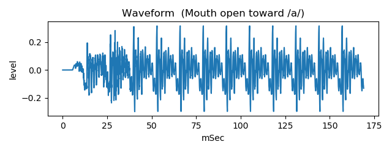
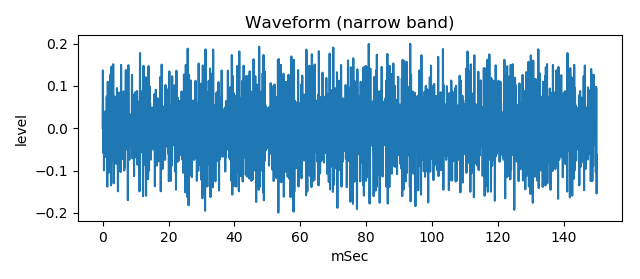
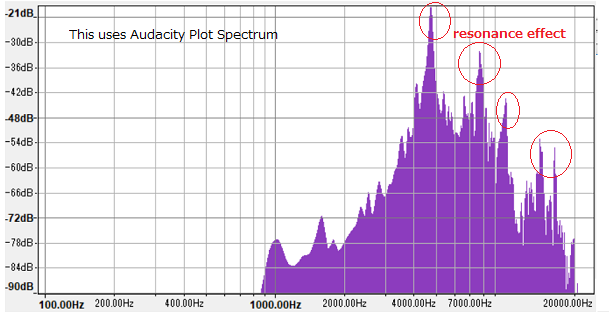
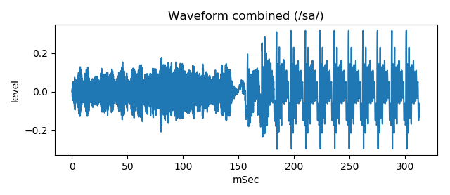

# vocal tract tube noise model   
   
This is an experiment to generate fricative voice /sa/ sound by two tubes model and noise source instead of turbulent sound.  
  
[github repository](https://github.com/shun60s/Vocal-Tube-Noise-S-Model)  

## usage   
The voice /sa/ sound consists of two parts, that are preceding noise sound and following vowel sound.  

Generate following vowel sound  
```
python3 main2var.py
```
  


Generate preceding noise sound, using perlin noise  
```
python3 PerlinNoise.py
```
  


Apply resonance effect to the noise  
```
python3 main2noiseresona.py
```
  


Combine preceding noise sound and following vowel sound  
```
python3 make_sa.py
```
  
This will save sa_like.wav that sounds similar to voice /sa/ sound.  


## Generated sample  

There are sample wav files of generated waveform in the generated_waveform folder.  


## Document  

There is a document [Explain-E.pdf](docs/Explain-E.pdf) in the docs folder.  
For more information, please see related WEB [Fricative voice /sa/ sound waveform generation by two tubes model and noise source](https://wsignal.sakura.ne.jp/onsei2007/python4-e.html) or 
[same content in Japanese](https://wsignal.sakura.ne.jp/onsei2007/python4.html)  


## License    
MIT  
Regarding to PerlinNoise.py, please follow the notice in the source code. 
